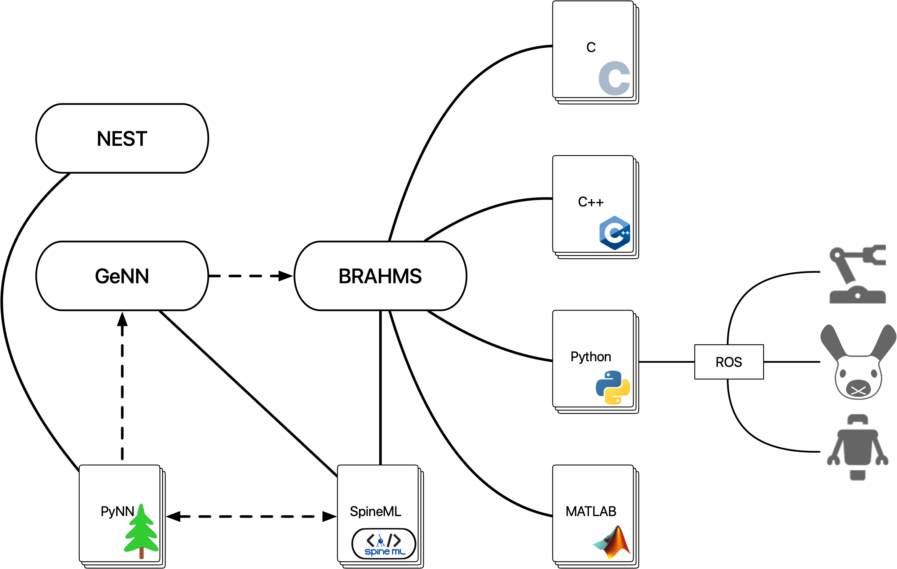

# MammalBot
Computational models and related work for the MammalBot cognitive architecture.

*This open source software code was developed in part or in whole in the Human Brain Project, funded from the European Union’s Horizon 2020 Framework Programme for Research and Innovation under the Specific Grant Agreement No. 785907 (Human Brain Project SGA2).*

## Further reading
* BRAHMS:
	* [General documentation](http://brahms.sourceforge.net/docs/)
	* [BRAHMS Manager](http://brahms.sourceforge.net/docs/BRAHMS%20Manager.html)
	* [Python process development tutorial](http://brahms.sourceforge.net/docs/Quick%20Start%20(1262).html)
	* [Python component bindings reference](http://brahms.sourceforge.net/docs/Python%20(1262).html)
* MiRo:
	* [General documentation](http://labs.consequentialrobotics.com/miro-e/docs/)
	* [ROS interfaces](http://labs.consequentialrobotics.com/miro-e/docs/index.php?page=Technical_Interfaces_ROS_interface)
* SpineML / SpineCreator:
	* [General documentations](http://spineml.github.io)
	* [SpineCreator tutorial](http://spineml.github.io/spinecreator/tutorial/)
